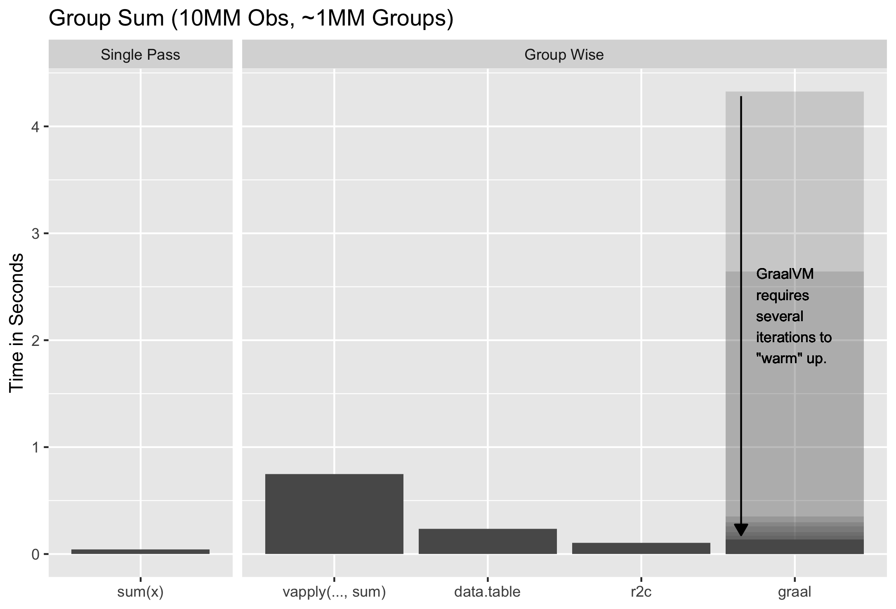
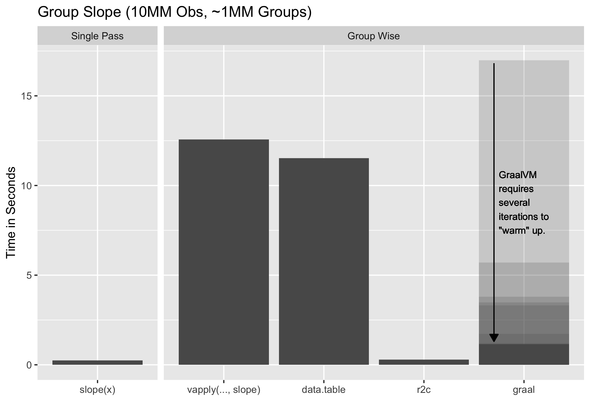
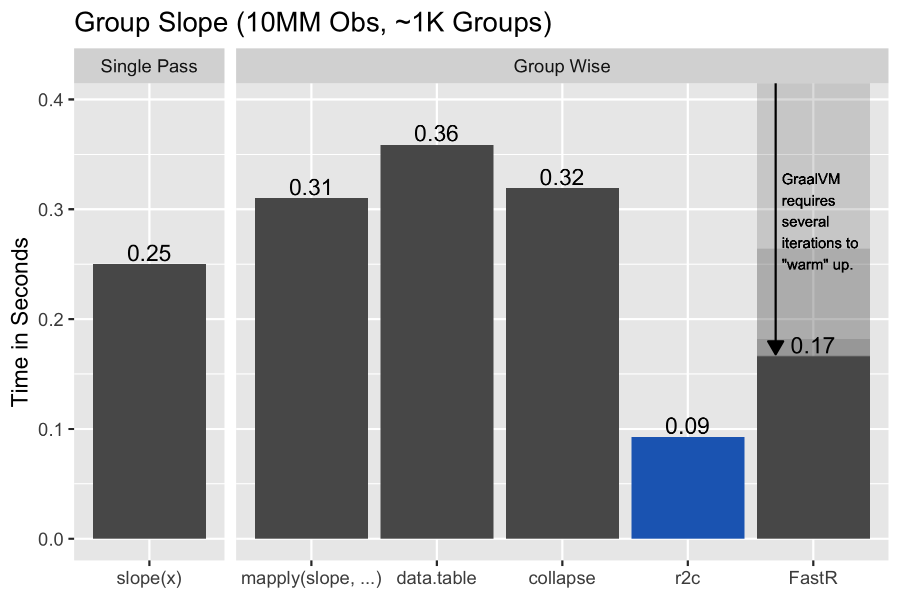

# r2c - Fast Iterated Statistic Computation in R

**Proof of Concept**.  Experimental, incomplete, with an interface subject to
change.

Compiles a subset of R into machine code so that expressions composed with that
subset can be applied repeatedly on varying data without interpreter overhead.

## Background and Motivation

R is nearly as fast as statically compiled languages for many common numerical
calculations:

    set.seed(1)
    n <- 1e7
    x <- runif(n) * runif(n)
    y <- runif(n) * runif(n)

    system.time(x + y)
    ##   user  system elapsed
    ##  0.023   0.000   0.023

    system.time(sum(x))
    ##   user  system elapsed
    ##  0.043   0.000   0.043

On [my system](#notes-on-benchmarking) that's about 2-5 **CPU cycles** for each
of the 10 million operations and associated loop overhead.  Hard to get much
faster[^1].  If we maintain a high ratio of native operations to R level calls
our programs will be fast.

Some tasks require more R-level calls, such as computing group statistics[^7]:

    g <- cumsum(sample(c(TRUE, rep(FALSE, 9)), n, replace=TRUE)) # sorted groups
    x.split <- split(x, g)
    y.split <- split(y, g)     # for later
    length(x.split)            # ~1MM groups
    ## [1] 1001458
    mean(lengths(x.split))     # ~10 average size
    ## [1] 9.99

    system.time(g.sum <- vapply(x.split, sum, 0))
    ##    user  system elapsed 
    ##   0.652   0.010   0.664 

Despite the same number of additions, our program **slowed by ~15x**.  And this
is with a primitive R function that does nothing but go directly to C code:

    sum
    ## function (..., na.rm = FALSE)  .Primitive("sum")

## What If We Could Compile R?

That would be nice, wouldn't it?  Well, we (at least I) can't compile the
entirety of R, but a small set we can manage:

    library(r2c)
    r2c_sum <- r2cq(sum(x))

And now:

    g.r2c <- process_groups(g, sorted=TRUE)   # pre-compute group sizes, labels
    system.time(g.sum.r2c <- group_exec(r2c_sum, g.r2c, x))
    ##   user  system elapsed 
    ##  0.054   0.001   0.056 
    identical(g.sum, g.sum.r2c)
    ## [1] TRUE

Nearly as fast as the simple sum despite the additional overhead of managing the
groups and the larger result.

## Alternatives

We compare `{r2c}` to various alternatives using pre-sorted and pre-grouped (or
split) data set as previously.  Pre-sorting and pre-grouping allows us to focus
timings on the statistic computation as the sorting and grouping steps will be
similar across most implementations.  Notwithstanding, fast group statistic
calculation benefits from fast sorting, and this is possible in R thanks to
[`{data.table}`][1] contributing their fast radix sort starting with R 3.3.0.

If you're satisfied with simple expressions such as `sum(x)` then there are
several alternatives:

For this specific task [`{collapse}`][4] makes an impressive case for itself[^4].
[`{FastR}`][2] is an implementation of R that can JIT compile R code to run on
the [Graal VM][3].  It requires a different runtime (i.e. you can't just run
your normal R installation) and has other trade-offs, including warm-up cycles
and compatibility limitations[^3].  But otherwise you type in what [you would
have in normal R](#in-r) and see some impressive speed-ups.

> The test is unfair to `{data.table}` as there is no method to pre-group the
> data for it (only pre-sort), and we disallow multi-threading, thus I would not
> use the above timings to pick alternatives over `{data.table}`.

The key feature that `{r2c}` adds is the  ability to construct complex
expressions from simple ones.  For example, the slope of a bivariate regression:

    slope <- function(x, y) sum((x - mean(x)) * (y - mean(y))) / sum((x - mean(x))^2)

And for this `{r2c}` is fastest[^9]:

`{data.table}` cannot use its Gforce[^2] optimization on the more complex
expression so falls back to standard evaluation.  `{collapse}` remains close to
`{r2c}`, but it requires enough knowledge of its workings to craft the
equivalent expression[^8]:

    library(collapse)
    g.clp <- GRP(g)    # pre-compute group sizes, labels
    fmean2 <- function(x, cg) fmean(x, cg, TRA="replace_fill")  # notice TRA=...

    fsum((x - fmean2(x, g.clp)) * (y - fmean2(y, g.clp)), g.clp) / fsum((x - fmean2(x, g.clp))^2, g.clp)

Compare to `{r2c}` and the other options where you compose the expression as
you would in [base R](#r2c-slope):

    r2c_slope <- r2cq(
      sum((x - mean(x)) * (y - mean(y))) / sum((x - mean(x))^2)
    )
    group_exec(r2c_slope, g.r2c, list(x, y))

We'll run one last comparison: large groups.  Here we try with average size
of ~10,000 elements (vs 10 previously):

In this case the per-group interpreter overhead is no longer noticeable and most
implementations are competitive.  `{r2c}` likely performs better because it
re-uses the memory required for intermediate results for every group.  The more
complex expressions are, the more this benefit should manifest.

To summarize:

> `{r2c}` is fastest at calculating complex expressions group-wise, while also
> retaining base R semantics for numeric inputs.

## Caveats - Of Course ...

First is that `r2c` requires compilation.  I have not included that step in
timings[^6] under the view that the compilation time will be amortized over many
calculations.  The facilities for this don't exist yet, but the plan is to to
have `{r2c}` maintain a local library of pre-compiled user-defined functions,
and for packages to compile `{r2c}` functions at install-time.

More importantly, we cannot compile and execute arbitrary R expressions:

* Only `{r2c}` implemented counterpart functions may be used (currently: basic
  arithmetic operators and `sum`/`mean`)
* Primary numeric inputs must be attribute-less (e.g. to avoid expectations of
  S3 method dispatch or attribute manipulation), and any `.numeric` methods
  defined will be ignored[^10].
* Future `{r2c}` counterparts will be limited to functions that return
  attribute-less numeric vectors of constant size (e.g. `mean`), or of the size
  of one of their inputs (e.g. like `+`, or even `quantile`).

Within these constraints `r2c` is flexible.  For example, it is possible to have
arbitrary R objects for secondary parameters, as well as to reference
group-invariant data:

    w <- c(1, NA, 2, 3)
    u <- c(-1, 1, 0)
    h <- rep(1:2, each=2)

    r2c_fun <- r2cq(sum(x, na.rm=TRUE) * y)
    group_exec(r2c_fun, groups=h, data=list(x=w), MoreArgs=list(y=u))
    ##  1  1  1  2  2  2
    ## -1  1  0 -5  5  0

Notice the `na.rm`, and that the `u` in `list(y=u)` is re-used in full for each
group setting the output size to 3.

The C counterparts to the R functions are intended to produce identical outputs,
but have different implementations.  As such, it is possible that for a
particular set of inputs on a particular platform the results might diverge.

## Future - Maybe?

In addition to cleaning up the existing code, there are many extensions that can
be built on this proof of concept.  Some are listed below.  How many I end up
working on will depend on some interaction of external and my own interest.

### Better Grouping Semantics

Implement multi-column grouping and non-integer grouping columns.

### More Functions

Functions that have direct analogues in C or are simple to code in C are the
best candidates, subject to the previously described restrictions.  Thus the
following should be straightforward to implement:

* `abs`, unary `+` and `-`.
* `min`, `max`, `first`, `last`.
* `cos`, `sin`, and other trigonometric functions.
* `range`.
* `length`, `seq_along`.
* `[[`, `[`, and maybe `$`, likely with limitations on allowable index types.
* Many others.

More challenging due to code complexity, but otherwise compatible with `{r2c}`:

* `quantile`, and others.

Some other useful functions will require more work:

* `diff`, because the result size of `n - 1` is not currently supported.

Functions that will likely not be implementable:

* `seq`, except perhaps for narrow cases where the parameters are constants or
  perhaps select expressions such as `length(n)`, but even this becomes
  complicated.
* And many more.

### Simple Assignment and Multi-Line Statements

While non-trivial, the existing structure should allow explicit intermediate
variables and multi-call expressions.  Both of these already exist implicitly as
part of the call processing logic.

### Other Repetition Structures

#### Window Functions

It will be straightforward to implement a runner that invokes the compiled code
on a sliding window instead of on groups.  The main complication is accounting
for incomplete windows at the beginning and end of the data.

#### Loops

More complex but in theory possible are loops that reference read/write vectors
with subsetting and subset assignment, thus allowing results of previous loop
iterations to be re-used in later ones.

#### Solvers

It should be possible to build a solver around `r2c` compiled expressions, but
there already exist similar implementations.  In particular Rich FitzJohn's
[`{Odin}`](https://github.com/mrc-ide/odin) uses a very similar approach to
`r2c` to generate C routines for use with `deSolve`.

#### API

There are likely many applications that could benefit from the capabilities
provided by `{r2c}`.  It should be possible to define an interface for use by
external code.  Conceivably, `{data.table}` could be extended to run `{r2c}`
compiled expressions.

Additionally, it should be possible to allow users to define their own C
routines that integrated into the `{r2c}` framework.

### Re-using Compilation / Cleanup

Ideally once an expression is compiled into an `{r2c}` function it would be
preserved for re-use in future R sessions.  Doing so within a package would be
relatively straight-forward, but it should also be possible to create a local
library to store such objects in.

We'll also need to ensure that the methods we use to access the compiled
instructions are legal, as what we do now is slightly questionable.  More
generally, the C internals have been implemented with the sole priority of
producing a proof of concept rather than robust extensibility, and will need
cleanup.

### Optimizations

* More aggressive re-use of intermediate memory.
* Identification of re-used calculations.
* Reduce per-group/iteration overhead.

And likely more.  So far the focus has been on implementation rather than
optimization.

## Related Work

* [`{Odin}`](https://github.com/mrc-ide/odin), which implements a very similar R
  to C translation and compilation, but specialized for differential
  equation solving problems.
* [`{data.table}`][1]'s Gforce (see `?data.table::datatable.optimize).
* [`{FastR}`][2] an implementation of R that can JIT compile R code to run on
  the [Graal VM][3].
* [`{collapse}`][4]'s specialized group statistic functions.
* [`{inline}`][7] to allow compilation and access to generated native code
  directly from R.
* In theory [`{dplyr}`][5]'s Hybrid Eval is similar to Gforce, but AFAICT it was
  [quietly dropped][6] and despite suggestions it might return for v1.1 I see no
  trace of it in the most recent 1.1 candidate development versions (as of
  2022-07-03).
* The [Hydra Chronicles][9] series of posts on my blog examining group
  statistics in R.

## Acknowledgments

* R Core for developing and maintaining such a wonderful language.
* [Matt Dowle](https://github.com/mattdowle) and [Arun
  Srinivasan](https://github.com/arunsrinivasan) for contributing the
  `{data.table}`'s radix sort to R.
* [Sebastian Krantz](https://github.com/SebKrantz) for the idea of pre-computing
  group meta data for possible re-use (taken from `collapse::GRP`).
* [Hadley Wickham](https://github.com/hadley/) and [Peter
  Danenberg](https://github.com/klutometis) for
  [roxygen2](https://cran.r-project.org/package=roxygen2).
* [Tomas Kalibera](https://github.com/kalibera) for
  [rchk](https://github.com/kalibera/rchk) and the accompanying vagrant image,
  and rcnst to help detect errors in compiled code.
* [Winston Chang](https://github.com/wch) for the
  [r-debug](https://hub.docker.com/r/wch1/r-debug/) docker container, in
  particular because of the valgrind level 2 instrumented version of R.
* [Hadley Wickham](https://github.com/hadley/) et al. for
  [ggplot2](https://ggplot2.tidyverse.org/).

## Notes on Benchmarking

Benchmarks are under:

    R version 4.2.0 (2022-04-22)
    Platform: x86_64-apple-darwin17.0 (64-bit)
    Running under: macOS Big Sur/Monterey 10.16

On an Intel(R) Core(TM) m5-6Y54 CPU @ 1.20GHz (early 2016 Macbook), using the
average of 11 iterations run after one `gc()` call, and -O2 optimization level.
Different systems / compilers / settings may produce different results.

[1]: https://github.com/Rdatatable
[2]: https://github.com/oracle/fastr
[3]: https://www.graalvm.org/
[4]: https://github.com/SebKrantz/collapse
[5]: https://dplyr.tidyverse.org/
[6]: https://github.com/tidyverse/dplyr/issues/5017
[7]: https://github.com/eddelbuettel/inline
[8]: https://twitter.com/BrodieGaslam/status/1527829442374025219?s=20&t=rg6aybJlGxPEUwBsI0ii1Q
[9]: https://www.brodieg.com/tags/hydra/

[^1]: Depending on your compilation settings and machine, there is room for
  improvement, but not enough that R stands out as being particularly slow at
  this task.
[^2]: Gforce is available for simple expressions of the form `fun(var)` for
  many of the basic statistic functions (see `?data.table::datatable.optimize).
[^3]: My limited experience with {`FastR`}is that it is astonishing, but also
  frustrating.  What it does is amazing, but the compatibility limitations are
  real (e.g.  with the current version neither {`data.table`} nor {`ggplot2`}
  install out of the box, and more), and performance is volatile (e.g. package
  installation and some other tasks are painfully slow, some expressions will
  hiccup after the initial warm-up).  At this point it does not seem like a
  viable drop-in replacement to R.  It likely excels at running scalar
  operations in loops and similar, something that R itself struggles at.
[^4]: Notice that `fsum` with groups is faster than
  even the straight up `sum` without groups, primarily because it handles the
  `narm` as a dedicated branch instead of a conditional in the loop (this is an
  [oddity with `sum`][8] on some platforms).  `fsum` also uses a plain double
  accumulator and not the long double used by the other implementations so the
  results are not identical to the other implementations that use long doubles
  (on systems that support them).  Curiously on my system summing long doubles
  is faster than summing doubles (absent NAs, inifinities, or denormals, for
  which long double performance collapses).
[^5]: We can make `{collapse}` a little faster by computing `mean(x)` once and
  re-using the result, but at that point the comparison is not apples to apples
  anymore.
[^6]: The first compilation can be quite slow as it requires loading the
  compiler, etc.  Subsequent compilations run in the tenths of seconds.
[^7]: For this very specific task R also provides `rowsum`, but as it is limited
  to sums and we cannot separate the splitting and summing steps for timing we
  will not discuss it further.
[^8]: Alternatives involve using `fwithin(x)` as a replacement for
  `(x - fmean(x, g, TRA="replace_fill"))` and `fgroup_by(g) |> fsummarize(...)`
  to avoid the need to repeatedly specify groups, although timings are similar
  with these changes.
[^9]: In order to make the benchmarks comparable, we use `r2c::mean1` instead of
  `base::mean`.  This is to ensure that all implementations are using a single
  pass mean calculation as that is what `fmean` does.
[^10]: E.g. don't expect S3 dispatch to work if you define `mean.numeric`,
  although why one would do that for functions covered by `{r2c}` is unclear.

