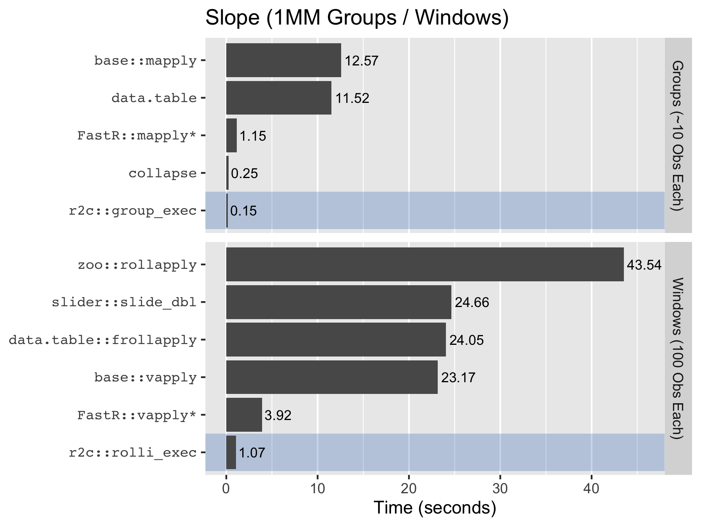
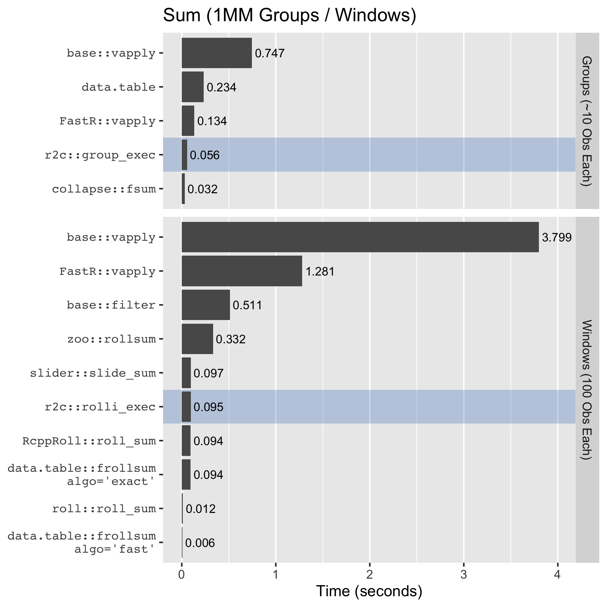

# r2c - Fast Iterated Statistic Computation in R

**Proof of Concept**.  Experimental, incomplete, with an interface subject to
change.

"Compiles" a subset of R into machine code so that expressions composed with
that subset can be applied repeatedly on varying data without interpreter
overhead.  `{r2c}` provides speed ups of up to 100x for iterated statistics,
with R semantics, and without the challenges of directly compilable languages.

## "Compiling" R

`{r2c}` "compiles" R expressions or functions composed of basic binary operators
and statistics.  `{r2c}` also supports multi-line statements and assignment.
"Compile" is in quotes because `{r2c}` generates an equivalent C program, and
compiles that.  To compute the slope of a single variable regression we might
use:

    library(r2c)

    slope <- function(x, y) sum((x - mean(x)) * (y - mean(y))) / sum((x - mean(x))^2)
    r2c_slope <- r2cf(slope)

    with(iris, r2c_slope(Sepal.Width, Sepal.Length))
    ## [1] -0.2233611
    with(iris, slope(Sepal.Width, Sepal.Length))
    ## [1] -0.2233611

While "r2c_fun" functions can be called in the same way as normal R functions as
shown above, there is limited value in doing so.  The primary use case of
`{r2c}` functions is iteration.

## Iterating `{r2c}` Functions

`{r2c}` is fast because it avoids the R interpreter overhead otherwise required
for each iteration.  There are currently two iteration mechanisms available:

* `group_exec`: compute on disjoint groups in data (a.k.a. split-apply-combine).
* `roll*_exec`: compute on (possibly) overlapping sequential windows in data.

For example, to iterate the slope function by groups, we could use:

    with(iris, group_exec(r2c_slope, list(Sepal.Width, Sepal.Length), Species))
    ##    setosa versicolor  virginica
    ## 0.6904897  0.8650777  0.9015345

I have not found good alternatives for the general[^14] use case of `{r2c}`, as
can be seen from the timings of computing group and window slopes on [larger
data][26] [sets][27][^15]:



`{r2c}` is substantially faster, primarily because it does not require calling
an R function for each iteration.  `{collapse}` does well with group statistics
if you can translate a regular R expression to one that will be fast with it.
`{FastR}` is also interesting, but has other drawbacks including the need for
its own runtime application, and multiple warm up runs before reaching fast
timings (<sup>`*`</sup>times shown are after 4-5 runs).

For the special case of a simple statistic many packages provide dedicated
pre-compiled alternatives, some of which are faster than `{r2c}`:



Even for the simple statistic case `{r2c}` is competitive with dedicated
compiled alternatives like those provided by `{RcppRoll}`, and `{data.table}`'s
`frollsum` in "exact" mode.  Implementations that re-use overlapping window
sections such as `{data.table}`'s `frollsum` in "fast" mode, `{roll}`, and
`{slider}`, will outperform `{r2c}`, particularly for larger windows.
`{data.table}` and `{roll}` use "on-line" algorithms, and `{slider}` uses a
"segment tree" algorithm, each with varying speed and precision trade-offs[^13].

See [Related Work](#related-work) and [benchmark details][10].

To summarize:

> For iterated calculations on numeric data, `{r2c}` is fastest at complex
> expressions, and competitive with specialized pre-compiled alternatives for
> simple expressions.  Additionally, `{r2c}` observes base R semantics for the
> expressions it evaluates; if you know R you can easily use `{r2c}`.

## Caveats

First is that `r2c` requires compilation.  I have not included that step in
timings[^6] under the view that the compilation time will be amortized over many
calculations.  The facilities for this don't exist yet, but the plan is to to
have `{r2c}` maintain a local library of pre-compiled user-defined functions,
and for packages to compile `{r2c}` functions at install-time.

More importantly, we cannot compile and execute arbitrary R expressions:

* Only `{r2c}` implemented counterpart functions may be used (currently: basic
  arithmetic/relational/comparison operators, statistics, `{`, and `<-`).
* Primary numeric inputs must be attribute-less (e.g. to avoid expectations of
  S3 method dispatch or attribute manipulation), and any `.numeric` methods
  defined will be ignored[^10].
* Future `{r2c}` counterparts will be limited to functions that return
  attribute-less numeric vectors of constant size (e.g. `mean`), or of the size
  of one of their inputs (e.g. `+`, or even `quantile`).

Within these constraints `r2c` is flexible.  For example, it is possible to have
arbitrary R objects for secondary parameters, as well as to reference
iteration-invariant data:

    w <- c(1, NA, 2, 3)
    u <- c(-1, 1, 0)
    h <- rep(1:2, each=2)

    r2c_fun <- r2cq(sum(x, na.rm=TRUE) * y)
    group_exec(r2c_fun, data=list(x=w), groups=h, MoreArgs=list(y=u))
    ##  1  1  1  2  2  2
    ## -1  1  0 -5  5  0

Notice the `na.rm`, and that the `u` in `list(y=u)` is re-used in full for each
group setting the output size to 3.

With the exception of `ifelse`, the C counterparts to the R functions are
intended to produce identical outputs, but have different implementations.  As
such, it is possible that for a particular set of inputs on a particular
platform the results might diverge.

## Future - Maybe?

In addition to cleaning up the existing code, there are many extensions that can
be built on this proof of concept.  Some are listed below.  How many I end up
working on will depend on some interaction of external interest and my own.

* Expand the set of R functions that can be translated.
* Nested "r2c_fun" functions.
* Multi/character/factor grouping variables.
* Additional runners (e.g. an `apply` analogue).
* Library for previously "compiled" functions.
* Basic loop support, and maybe logicals and branches.
* Get on CRAN (there is currently at least one questionable thing we do).
* API to allow other native code to invoke `{r2c}` functions.

## Installation

This package is not available on CRAN yet.  To install:

```
f.dl <- tempfile()
f.uz <- tempfile()
github.url <- 'https://github.com/brodieG/r2c/archive/main.zip'
download.file(github.url, f.dl)
unzip(f.dl, exdir=f.uz)
install.packages(file.path(f.uz, 'r2c-main'), repos=NULL, type='source')
unlink(c(f.dl, f.uz))
```

Or if you have `{remotes}`:

```
remotes::install_github("brodieg/r2c")
```

## Related Work

### "Compiling" R

[`FastR`][2] an implementation of R that can JIT compile R code to run on the
[Graal VM][3].  It requires a different runtime (i.e. you can't just run your
normal R installation) and has other trade-offs, including warm-up cycles and
compatibility limitations[^3].  But otherwise you type in what you would have
in normal R and see some impressive speed-ups.

[The Ř virtual machine][19] an academic project that is superficially similar to
`FastR` (its [thesis][20] explains differences).  Additionally [`renjin`][18]
appears to offer similar capabilities and tradeoffs as `FastR`.  I have tried
neither `Ř` nor `renjin`.

Closer to `{r2c}`, there are at least four packages that operate on the
principle of translating R code into C (or C++), compiling that, and providing
access to the resulting native code from R:

* [`{Odin}`](https://github.com/mrc-ide/odin), specialized for differential
  equation solving problems.
* [`{ast2ast}`](https://github.com/Konrad1991/ast2ast/), also targeting ODE
  solving and optimization.
* [`{armacmp}`](https://github.com/dirkschumacher/armacmp), a DSL for
  formulating linear algebra code in R that is translated into C++.
* [`{nCompiler}`](https://github.com/nimble-dev/nCompiler), a tool for
  generating C++ and interfacing it with R.

Most of these seem capable of computing iterated statistics in some form, and
experienced users can likely achieve it with some work, but it will likely be
difficult for someone familiar only with R.

Finally, [`{inline}`][7] and [`{Rcpp}`][16] allow you to write code in C/C++ and
easily interface it with R.

### Fast Group and Rolling Statistics

I am unaware of any packages that compile R expressions to avoid interpreter
overhead in applying them over groups or windows of data.  The closest are
packages that recognize expressions for which they have equivalent pre-compiled
code they run instead.  This is limited to simple statistics:

* [`{data.table}`][1]'s Gforce (see `?data.table::datatable.optimize`).
* In theory [`{dplyr}`][5]'s Hybrid Eval is similar to Gforce, but AFAICT it was
  [quietly dropped][6] and despite suggestions it might return for v1.1 I see no
  trace of it in the most recent 1.1 candidate development versions (as of
  2022-07-03).

Additionally, there is [`{collapse}`][4] which provides specialized group
statistic functions.  These are quite fast, particularly for simple statistics,
but you have to be familiar with `{collapse}` semantics to compose complex
statistics from simple ones.

Several packages provide fast dedicated functions for a small set of simple
rolling window statistics:

* `base::filter` for weighted rolling sums / means.
* [`{data.table}`][1]'s `froll*` functions.
* [`{slider}`][14] `slide_<stat>` and `slide_index_<stat>`.
* [`{roll}`][22].
* [`{zoo}`][12] `roll<stat>`.
* [`{RcppRoll}`][23].
* [`{runner}`][24].

## Acknowledgments

* R Core for developing and maintaining such a wonderful language.
* [Matt Dowle](https://github.com/mattdowle) and [Arun
  Srinivasan](https://github.com/arunsrinivasan) for contributing the
  `{data.table}`'s radix sort to R.
* [Sebastian Krantz](https://github.com/SebKrantz) for the idea of pre-computing
  group meta data for possible re-use (taken from `collapse::GRP`).
* [Achim Zeileis][11] et al. for `rollapply` in [`{zoo}`][12] from the design of
  which `roll*_exec` borrows elements.
* [David Vaughan][13] for ideas on window functions, including the index concept
  (`position` in the `roll*_exec` functions, borrowed from [`{slider}`][14]).
* Byron Ellis and [Peter Danenberg](https://github.com/klutometis) for the
  inspiration behind `lcurry` (see [`functional::CurryL`][15]), used in tests.
* [Hadley Wickham](https://github.com/hadley/) and [Peter
  Danenberg](https://github.com/klutometis) for
  [roxygen2](https://cran.r-project.org/package=roxygen2).
* [Tomas Kalibera](https://github.com/kalibera) for
  [rchk](https://github.com/kalibera/rchk) and the accompanying vagrant image,
  and rcnst to help detect errors in compiled code.  Tomas also worked on the
  [precursor to the Oracle `FastR`][21].
* [Winston Chang](https://github.com/wch) for the
  [r-debug](https://hub.docker.com/r/wch1/r-debug/) docker container, in
  particular because of the valgrind level 2 instrumented version of R.
* [Hadley Wickham](https://github.com/hadley/) et al. for
  [ggplot2](https://ggplot2.tidyverse.org/).


[1]: https://github.com/Rdatatable
[2]: https://github.com/oracle/fastr
[3]: https://www.graalvm.org/
[4]: https://github.com/SebKrantz/collapse
[5]: https://dplyr.tidyverse.org/
[6]: https://github.com/tidyverse/dplyr/issues/5017
[7]: https://github.com/eddelbuettel/inline
[8]: https://twitter.com/BrodieGaslam/status/1527829442374025219?s=20&t=rg6aybJlGxPEUwBsI0ii1Q
[9]: https://www.brodieg.com/tags/hydra/
[10]: https://htmlpreview.github.io/?https://raw.githubusercontent.com/brodieG/r2c/abf1dd726beb980b12ae1b554e8bcd2df8b47e18/extra/benchmarks/benchmarks-public.html
[11]: https://www.zeileis.org/
[12]: https://cran.r-project.org/package=zoo
[13]: https://github.com/DavisVaughan
[14]: https://github.com/r-lib/slider
[15]: https://cran.r-project.org/package=functional
[16]: https://cran.r-project.org/package=Rcpp
[17]: https://docs.renjin.org/en/latest/package/index.html
[18]: https://www.renjin.org/index.html
[19]: https://r-vm.net
[20]: https://thesis.r-vm.net/main.html
[21]: https://github.com/allr/purdue-fastr
[22]: https://github.com/jjf234/roll
[23]: https://cran.r-project.org/package=RcppRoll
[24]: https://cran.r-project.org/web/packages/runner/index.html
[25]: https://cran.r-project.org/web/packages/roll/readme/README.html
[26]: https://htmlpreview.github.io/?https://raw.githubusercontent.com/brodieG/r2c/3caf106980e558c931aea554e1f0197a82d031a3/extra/benchmarks/benchmarks-public.html#group-data
[27]: https://htmlpreview.github.io/?https://raw.githubusercontent.com/brodieG/r2c/3caf106980e558c931aea554e1f0197a82d031a3/extra/benchmarks/benchmarks-public.html#window-data

[^3]: My limited experience with `{FastR}`is that it is astonishing, but also
  frustrating.  What it does is amazing, but the compatibility limitations are
  real (e.g.  with the current (c.a. Summer 2022) version neither `{data.table}`
  nor `{ggplot2}` install out of the box, and more), and performance is volatile
  (e.g. package installation and some other tasks are painfully slow, some
  expressions will hiccup after the initial warm-up).  At this point it does not
  seem like a viable drop-in replacement to R.  It likely excels at running
  scalar operations in loops and similar, something that R itself struggles at.
[^6]: The first compilation can be quite slow as it requires loading the
  compiler, etc.  Subsequent compilations run in tenths of seconds.
[^10]: E.g. don't expect S3 dispatch to work if you define `mean.numeric`,
  although why one would do that for functions covered by `{r2c}` is unclear.
[^13]: The "segment tree" algorithm will have better precision than the
  "on-line" algorithm, and while it is slower than the "on-line" algorithm (see
  the [`{roll}` README][25] for an explanation), it will begin to outperform
  `{r2c}` at window sizes larger than 100 as its performance scales with the
  logarithm of window size.  The "on-line" algorithm is most susceptible to
  precision issues, but at least on systems with 80bit long double accumulators,
  it seems likely that the "on-line" algorithm will be sufficiently precise for
  most applications.
[^14]: It turns out there is `roll::roll_lm` that can compute slopes, but it
  cannot handle the general case of composing arbitrary statistics from the
  ones it implements.
[^15]: These timings do not include the `reuse_calls` optimization added in
  0.2.0.
